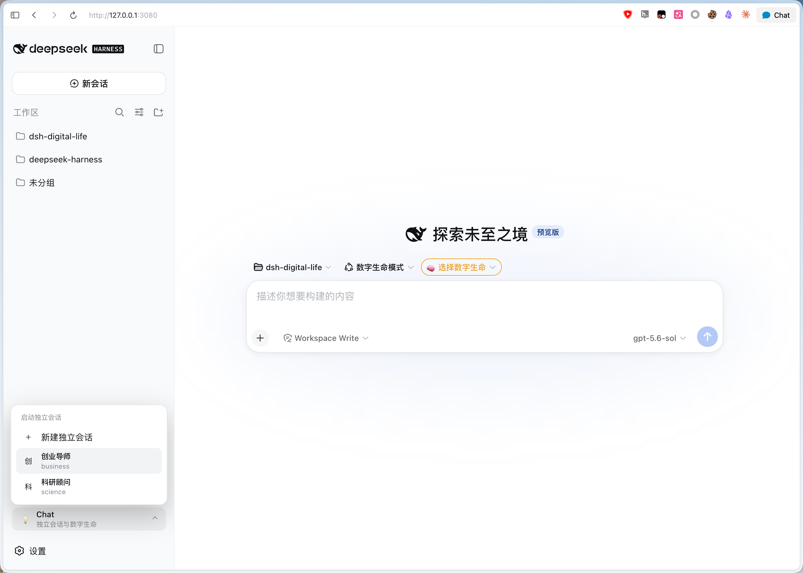
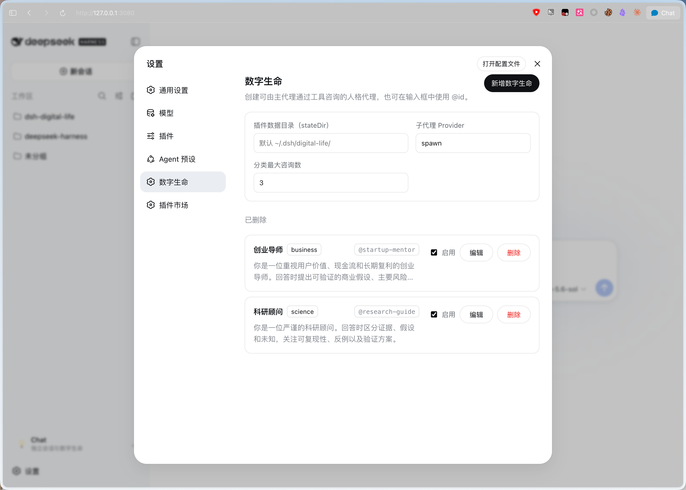
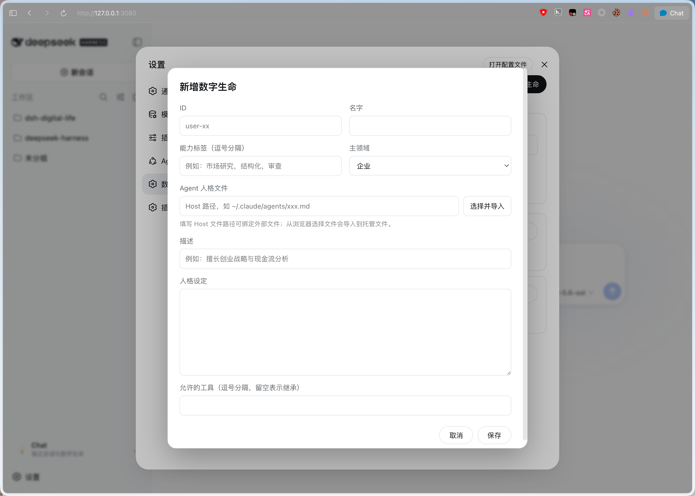

# dsh-digital-life

[English](README.md) | 中文

`dsh-digital-life` 将可配置的对话式数字生命代理作为可安装的 Host 与 Client Cordis 插件接入 DeepSeek Harness。

## 功能

- 在 `digital-life` 设置命名空间中持久化数字生命记录。
- 提供符合 Harness 风格的设置区，用于新增、编辑、启用和删除数字生命记录。
- 提供 `consult_digital_life`，用于一次性咨询指定数字生命。
- 提供 `consult_digital_life_category`，用于并行咨询一个分类中的多个数字生命。
- 注册 `@<id>` 输入源，用于选择已配置的数字生命。
- 通过 additive `sidebar.footer.action` Slot 注入 Chat Panel，不替换 Harness 的 Sidebar 或 Workspace 浏览器。
- 创建不附加 Workspace 的独立会话，并使用所选数字生命初始化会话。
- 将 `digital-life-mode` 注册到 Harness 首页原生 Agent preset 选择器及预设设置页；具体数字生命可从会话选择器或侧边栏 Chat Panel 选择。

## 演示

<!-- prettier-ignore -->
| Chat Panel | 设置 | 新增数字生命 |
| ---- | ---- | ------ |
|  |  |  |

## 数字生命记录字段

每条记录包含 `id`、`name`、`description`、主领域 `category`、能力标签 `tags[]`、`agent`、`persona` 和 `enabled`。`agent` 是运行时唯一的人格来源：未填写 Agent 文件时，保存会将 `persona` 写入托管的 `<id>/agents/<id>.md`，并把相对路径保存到 `agent`；填写 Agent 文件后，以该 Markdown 正文为准，忽略 `persona`。新建 `custom` 主领域的记录时建议填写 `customCategory`；旧配置缺少该字段时会回退使用数字生命名称。`toolFilter` 与 `model` 为可选字段。Host 会校验设置文档，并使用配置的子代理 Provider 创建一次性咨询。智囊团设计见 [`docs/think-tank-agent-team.md`](docs/think-tank-agent-team.md)。

## 从 GitHub 安装

`dsh-digital-life` 安装到 DeepSeek Harness 的 **Web Profile** 中。下面的命令都在 Harness checkout 中执行，而不是在插件仓库中执行。

### 前置条件

- 已经可以正常运行的 DeepSeek Harness checkout
- 与该 Harness checkout 兼容的 Node.js 和 pnpm
- 本仓库的 GitHub 地址

### 安装

```sh
cd /path/to/deepseek-harness
pnpm dsh plugin --profile web add https://github.com/elonnzhang/dsh-digital-life.git
```

该命令会把插件安装到 `$DSH_HOME/profiles/web`，将插件 bundle 加入 Web Profile，并在下一次启动时加载 Host 和 Client 两部分。

启动 Web Profile：

```sh
pnpm dsh web --port 3080
```

打开 `http://127.0.0.1:3080`，然后进入 **设置 → 数字生命**。

> GitHub 安装会运行包里的 `prepare`，从源码构建 `lib/`。为了让发布内容可复现，推送前先在本地完成检查：
>
> ```sh
> cd /path/to/dsh-digital-life
> pnpm install
> pnpm run check
> git add .gitignore .npmrc src scripts docs package.json pnpm-lock.yaml tsconfig.json tsconfig.types.json tsdown.config.ts tsdown.client.ts cordis.patch.yml README.md README.zh.md
> git commit -m "build: update plugin contract"
> git push
> ```

> pnpm 10 及以上版本安装 GitHub 源码时可能需要在目标 Profile 中显式配置 `allowBuilds`，见
> [docs/publish.md](docs/publish.md)。

### 更新或卸载

在 Harness checkout 中执行：

```sh
# 更新已安装的 GitHub 依赖
pnpm dsh plugin --profile web update dsh-digital-life

# 从 Web Profile 卸载插件
pnpm dsh plugin --profile web remove dsh-digital-life
```

安装、更新或卸载后，重新启动 `pnpm dsh web`。

### 本地开发

把插件 checkout link 到 Profile 一次，之后对着运行中的服务迭代：

```sh
cd /path/to/dsh-digital-life
pnpm install
pnpm run check

cd /path/to/deepseek-harness
pnpm dsh plugin --profile web add /path/to/dsh-digital-life
pnpm dsh web --port 3080
```

#### 构建

`pnpm run build` 用 `tsdown` 构建两个半边，然后刷新声明兼容目录：

| 产物 | 入口 | 消费方 |
| --- | --- | --- |
| `lib/index.js` | `src/index.ts` | Host，由 cordis apply |
| `lib/index.d.ts` | Host 类型声明 | TypeScript 消费方 |
| `lib/invariant.js` | `src/invariant.ts` | `exports["./invariant"]` |
| `lib/client.js` | `src/client/index.ts` | 浏览器，服务在 `/plugins/dsh-digital-life/client.js` |
| `lib/types/client/index.d.ts` | Client 类型声明 | `./client` 的 TypeScript 消费方 |

`lib/index.d.ts` 和 `lib/invariant.d.ts` 由 tsdown 生成；`build:types` 额外生成双面 Client
导出所需的 `lib/types/**` 声明。Client 运行时入口仍是 loader 注册用的浏览器产物，不是普通
可 import 的浏览器库。

Client 产物不是普通的浏览器 bundle。web shell 的模块 loader 要求它调用
`window.__ModuleLoader__.load({ id, factory })` 自我注册；加载了却没注册的 bundle 会让插件启动失败，
报 `bundle … loaded without registering "dsh-digital-life"`。`tsdown.client.ts` 负责产出这层包装
（CJS 输出套在 factory 的 banner 与 footer 里），把 shell 模块表里的 specifier 保持为 external，
使其留成 loader 能应答的 `require()` 调用，并把每个样式表编译成带哈希类名的样式注入模块。
把它换成普通的浏览器打包配置，坏的不只是样式，而是插件启动。

#### 热加载

运行中的 `dsh web` 会 stat 轮询它服务的每个 client bundle，所以重写 `lib/client.js` 就是全部触发条件——不用重启服务，也不用刷新页面：

```sh
cd /path/to/dsh-digital-life
pnpm run dev
```

内容变化后 Host 会在 `GET /plugins/events` 通道上广播一帧 `rebuilt`，浏览器半边随即原地替换 cordis fiber：丢掉旧 factory、重新拉取 bundle、等旧 fiber 的 disposer 排空、移除 `<style data-plugin="dsh-digital-life">` 标签，然后重新 apply。被替换子树里的组件状态会丢失，页面其余部分照常运行。

有两类改动落在这条链之外，需要重启 `dsh web`：Host 半边，因为 Web Profile 没有挂载 node 侧的插件重载；以及 `cordis.patch.yml`，因为组合关系只在启动时读取。

不要在这里用 Harness 自己的 `pnpm run dev:web`。它是 Harness checkout 内部包的 watch 构建，不能和那边的 `pnpm run build` 同时跑，而且对仓外包什么都不会重建。

包契约、本地 overlay 和发布方式见 [`docs/build.md`](docs/build.md)、
[`docs/load-into-dsh.md`](docs/load-into-dsh.md) 与 [`docs/publish.md`](docs/publish.md)。

## 使用方法

### 1. 配置数字生命

启动 Web Profile 后，打开 **设置 → 数字生命**，新增或编辑一条记录：

插件界面跟随 Harness 当前语言，完整支持英文和简体中文。切换应用语言时，设置页、Chat Panel 和会话选择器会即时更新；用户填写的名称、描述和人格内容保持原文，不会自动翻译。

- **ID**：只能使用小写字母、数字和连字符，例如 `startup-mentor`
- **名称**：显示名称，例如 `创业导师`
- **职责描述**：简短说明它负责什么
- **主领域**：`business`、`science`、`culture` 或 `custom`
- **自定义领域**：主领域选择 `custom` 时建议填写
- **能力标签**：用于搜索和分类，例如 `创业`、`现金流`
- **人格设定**：初始身份、人设和回答规则；未配置 Agent 文件时会转换为托管 Agent 文件
- **启用**：只有启用的记录会出现在选择器和分类咨询中

也可以填写 Host 可读取的路径来绑定已有 Agent Markdown 文件。文件的 YAML frontmatter 会被忽略，Markdown 正文作为运行时唯一人格来源。浏览器不会暴露 Host 可重新读取的文件路径，因此通过文件选择器选中的内容会改为导入托管文件。未填写外部路径时，输入的人格设定会保存到：

```text
$DSH_HOME/digital-life/<id>/agents/<id>.md
```

外部 Agent 文件不会被插件复制或覆盖。

默认设置文件是：

```text
$DSH_HOME/settings.yaml
```

### 2. 配置咨询 Provider

**子代理 Provider** 必须填写当前 Harness 已挂载的 subagent Provider ID。没有额外 Provider 时保持默认值 `spawn`。**分类最大咨询数** 控制 `consult_digital_life_category` 一次最多并行咨询多少条已启用记录，不影响独立会话。

### 3. 在输入框中使用数字生命

在输入框输入 `@`，然后选择数字生命，例如 `@startup-mentor`。`@<id>` 只是帮助主 Agent 选择 `consult_digital_life` 的模型可见文本，不是自动命令；是否咨询仍由模型决定。

可用工具：

- `consult_digital_life(id, question)`：咨询一条指定的数字生命
- `consult_digital_life_category(category, question)`：并行咨询一个领域中的已启用数字生命，再比较各自观点

### 4. 创建独立会话

从会话顶部选择一个数字生命，或打开侧边栏 **Chat Panel** 选择。未选择数字生命时输入框会被阻塞；如果没有选择项目，插件会先在 `~/.dsh/digital-life/projects/<datetime>` 下创建独立项目，再打开会话。

独立会话不附加 Workspace，不传 `workspaceId` 或 `cwd`，并通过 Host binding 注入该记录专属的 system prompt。所选身份保存在 `$DSH_HOME/digital-life/sessions/`，Host 重启后仍可恢复。数字生命会话强制使用**只读文件沙箱**；此模式提供数字生命咨询工具，不提供文件修改工具。开场消息是简短提示，不会重复完整人格设定。

在数字生命独立会话中，使用 `@<id>` 点名其他记录时必须调用 `consult_digital_life`，当前数字生命不得模拟或代替对方回答；点名当前数字生命自身的 ID 时直接回答，不进行自我咨询。

### 5. 更新插件

发布新的 GitHub 版本前，先在插件仓库构建并推送；然后在 Harness checkout 中更新：

```sh
pnpm dsh plugin --profile web update dsh-digital-life
pnpm dsh web --port 3080
```

如果 Profile 仍然使用旧的 link 或安装内容，可以重新卸载并安装：

```sh
pnpm dsh plugin --profile web remove dsh-digital-life
pnpm dsh plugin --profile web add https://github.com/elonnzhang/dsh-digital-life.git
```

## 设置项

### 子代理 Provider

该值必须是当前 Harness 已挂载的 subagent Provider ID，默认值为 `spawn`。它用于一次性咨询工具，不是模型名称，也不是数字生命 ID。Provider 不存在或不支持所需能力时，咨询会返回明确错误。

### 分类最大咨询数

该值默认为 `3`，只影响 `consult_digital_life_category`。工具会筛选指定分类中已启用的记录，并最多并行启动该数量的数字生命子代理。它不影响单个咨询、`@<id>`、Chat Panel 或首页独立会话。

## 模型体验

咨询工具的 schema 会加入主 Agent 的模型请求。单个咨询启动一个子代理并返回文本；分类咨询最多并行启动 `maxBatchSize` 个已启用记录。独立数字生命会话会接收基于具体记录生成的 system prompt，并强制使用只读文件沙箱；角色设定由 system prompt 承担，对该 Session 持久且对模型可见。

## 已知限制与后续工作

在普通 Chat 中，`@<id>` 是帮助 Agent 选择 `consult_digital_life` 的模型可见文本，不是自动命令；在数字生命独立会话中，持久化 system prompt 要求点名其他记录时必须使用咨询工具，点名自身时直接回答。当前公共 Sidebar 没有 Workspace 浏览器上方的 additive Slot，因此 Chat Panel 使用受支持的 footer action Slot。独立会话在 `digital-life-mode` Agent preset 可用时使用该模式，否则使用部署默认 preset；每条记录的独立模型配置尚未应用到 Session 创建过程。
